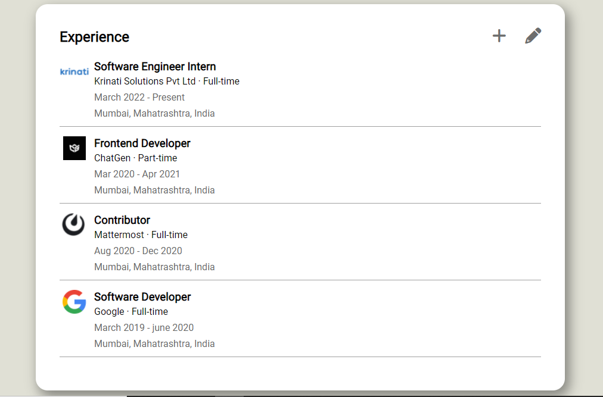

# LinkedinExp

#Live Demo: https://linked-in-experience-component.vercel.app/

This project is assisgnment from Krinati solutions for internship.

# Local setup

In terminal type below commands

`git clone git@github.com:kiranbabu7/LinkedIn-Experience-Component.git`

`cd LinkedIn-Experience-Component`
`npm install`
`ng serve` To run server locally.
